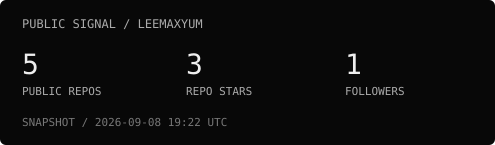
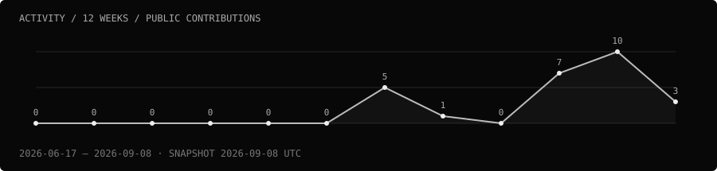

<div align="center">

<picture>
  <source media="(prefers-reduced-motion: reduce)" srcset="./assets/ascii-signal.svg">
  
</picture>

**BUILD → BREAK → UNDERSTAND → SHIP**

Systems / interfaces / experiments / open source.

[Projects](https://github.com/leemaxyum?tab=repositories) · [Build log](#build-log) · [Static hero](./assets/ascii-signal.svg)

</div>

I build things, pull them apart, and follow the questions they leave behind.
The work is the introduction. The archive stays open.

### `01 / system status`

```text
MODE      building in public
SIGNAL    systems + interfaces
METHOD    experiment / inspect / iterate
SOURCE    open
```

### `02 / selected transmissions`

**[TPLAYTV ↗](https://github.com/leemaxyum/TPLAYTV)**<br>
TV-first LAN multiplayer: phones join rooms as controllers; a shared display hosts the game. Express, Socket.IO, and typed game/controller contracts connect the pieces.

`phone input → room server → shared screen`

**[Phantom AI ↗](https://github.com/leemaxyum/phantom-ai)**<br>
A React chat interface with conversation persistence, Markdown/code rendering, and browser speech. Its shared server handler connects to Groq through an OpenAI-compatible API.

`conversation → server handler → model → response`

**[Forest Quest ↗](https://github.com/leemaxyum/Forest-Quest)**<br>
A Phaser browser platformer with enemy combat, fireballs, bosses, and character upgrades. A place to experiment with movement, collisions, and game state.

**[Portfolio ↗](https://github.com/leemaxyum/portfolio)**<br>
A Persona-inspired menu interface in HTML, CSS, and JavaScript. Separate model, view, and controller modules handle data, rendering, and navigation.

### `03 / engineering interests`

Real-time state · interface behavior · server boundaries · game systems · readable architecture.

**Open-source direction**<br>
Read the source → reproduce a problem → make a useful fix → explain the change → maintain it.

### `04 / telemetry`



<details>
<summary>Contribution signal / activity / optional coding time</summary>

#### Contribution snake


#### Activity graph



#### Coding time

<!--START_SECTION:waka-->
Coding-time telemetry is not connected.
<!--END_SECTION:waka-->

[GitHub activity](https://github.com/leemaxyum?tab=overview) · [Integration notes](./SETUP.md)

</details>

<a id="build-log"></a>

### `05 / build log`

**2026-09 · Profile signal** — hand-composed ASCII hero, source-checked project notes, and quieter telemetry.<br>
Follow the current work: [TPLAYTV commits](https://github.com/leemaxyum/TPLAYTV/commits) · [Phantom AI commits](https://github.com/leemaxyum/phantom-ai/commits) · [Forest Quest commits](https://github.com/leemaxyum/Forest-Quest/commits).

### `06 / principles`

- Build something real. Inspect what breaks.
- Read the source. Make the boundaries clear.
- Ship small. Leave the next person a useful trail.

---

<div align="center">

`leemaxyum // archive open`

[GitHub](https://github.com/leemaxyum) · [Repositories](https://github.com/leemaxyum?tab=repositories) · [Portfolio source](https://github.com/leemaxyum/portfolio)

</div>
