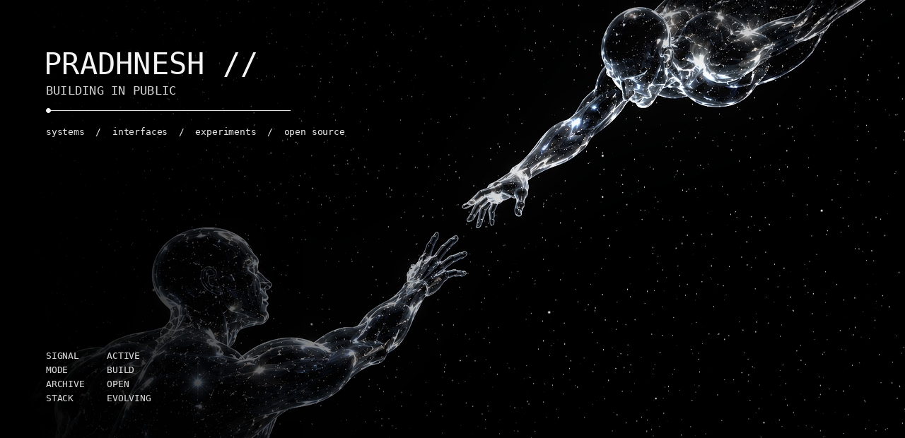
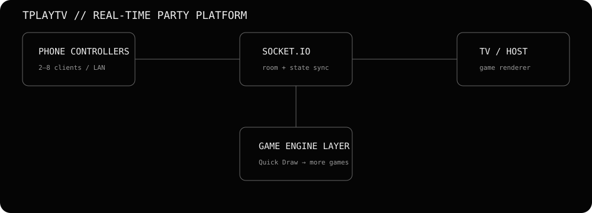
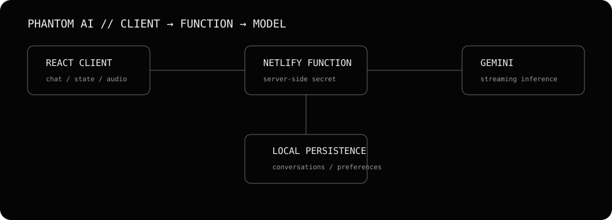
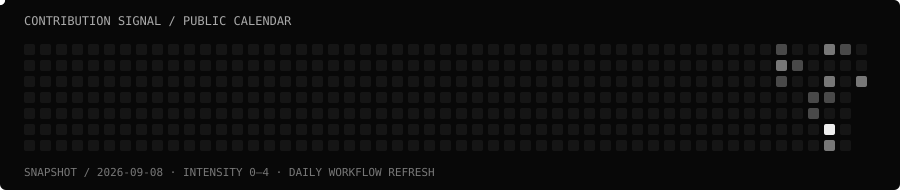

<div align="center">



<br>


<br>

<a href="https://github.com/leemaxyum?tab=repositories"></a>
<a href="https://github.com/leemaxyum"></a>
<a href="https://github.com/leemaxyum?tab=stars"></a>

</div>

---

## `~/about`

I build things, then keep pulling on the thread until I understand **why they work**.

No permanent niche. No stack loyalty. No pretending the roadmap is finished.

The common thread is simple:

> **make something real → learn what breaks → rebuild it better → ship the next version**

This profile is intentionally designed to grow with that process.

---

## `~/now`

```text
┌─ SIGNAL ───────────────────────────────────────────────────────────────┐
│                                                                       │
│  MODE        BUILD                                                   │
│  STATUS      ACTIVE                                                   │
│  FOCUS       software / systems / experiments                        │
│  OPEN SOURCE moving from user → contributor → maintainer              │
│  CURRENT     TPLAYTV · Phantom AI · Forest Quest                      │
│                                                                       │
└───────────────────────────────────────────────────────────────────────┘
```

---

## `~/featured`

### TPLAYTV — local multiplayer, TV-first

A PC/TV host turns phones into controllers over LAN. The project is evolving toward a reusable real-time multiplayer platform rather than a single game.



**Stack:** Node.js · Express · Socket.IO · Vite · TypeScript  
**Interesting problems:** room lifecycle · state synchronization · client isolation · latency · game protocol · reconnects

[Repository →](https://github.com/leemaxyum/TPLAYTV)

---

### Phantom AI — AI application engineering

A full chatbot application with streaming model responses, conversation state, Markdown/code rendering, browser speech, audio, and server-side API-key handling.



**Stack:** React · TypeScript · Vite · Gemini · Netlify Functions · Framer Motion  
**Interesting problems:** streaming UX · server boundaries · persistence · async state · product polish

[Repository →](https://github.com/leemaxyum/phantom-ai)

---

### Forest Quest — game systems

A browser action-platformer built without a game engine, using Canvas and JavaScript.

`explore → fight → upgrade → boss → repeat`

**Stack:** JavaScript · HTML5 Canvas · CSS  
[Repository →](https://github.com/leemaxyum/Forest-Quest)

---

## `~/toolbox`

<div align="center">


</div>

The list is deliberately a **toolbox**, not a résumé.  
Tools get added when a project gives me a reason to learn them.

---

## `~/engineering`

```text
REAL-TIME                 APPLICATIONS              SYSTEMS
──────────                ────────────              ───────
Socket.IO                 React                     networking
state synchronization     APIs                       architecture
rooms / sessions          async flows                persistence
latency                   UX                         deployment

COMPUTATION               OPEN SOURCE               BUILDING
───────────               ───────────                ────────
C++                       Git / GitHub                prototypes
Python                    issues / PRs                experiments
DSA                       documentation               games
math                      maintainership              weird ideas
```

---

## `~/open-source`

```text
LEVEL 01   learn the ecosystem
LEVEL 02   read real code
LEVEL 03   fix small things
LEVEL 04   submit useful PRs
LEVEL 05   own a subsystem
LEVEL 06   maintain something people depend on
```

The objective is not to collect contribution squares.

**The objective is to become useful to unfamiliar codebases.**

---

## `~/telemetry`

### GitHub

<div align="center">

GitHub activity and streak details are available on my [profile](https://github.com/leemaxyum).

</div>

### Repository signal

<div align="center">

<a href="https://github.com/leemaxyum/TPLAYTV">TPLAYTV on GitHub</a>
<a href="https://github.com/leemaxyum/phantom-ai">Phantom AI on GitHub</a>

</div>

### Contribution matrix



### Trophy wall

Trophies are available on my [GitHub profile](https://github.com/leemaxyum).

---

## `~/activity`

Recent activity is available on my [GitHub profile](https://github.com/leemaxyum).

---

## `~/time`

WakaTime can turn this section into actual build telemetry once the workflow is enabled.

```text
language distribution
editor / OS usage
daily coding time
weekly coding streak
```

See `SETUP.md` for the one-time secret setup.

---

## `~/build-log`

**2026**

```text
08  ── TPLAYTV        real-time multiplayer foundation
08  ── Phantom AI     AI application + server boundary
08  ── Forest Quest   Canvas game systems
08  ── Portfolio      architecture-first personal site
09  ── profile        turning the profile into an evolving interface
```

This log is intentionally short.

Projects should tell the story better than a list of adjectives.

---

## `~/principles`

- **Build before branding.**
- **Understand the abstraction before hiding behind it.**
- **Prefer working systems over impressive descriptions.**
- **Read source code.**
- **Ship small, then deepen the architecture.**
- **Keep the profile honest enough that the work can defend it.**

---

## `~/connect`

<div align="center">

<a href="https://github.com/leemaxyum">

</a>
<a href="https://github.com/leemaxyum?tab=repositories">

</a>

<br><br>

`leemaxyum` · building in public · archive open

</div>

---

<div align="center">


</div>
