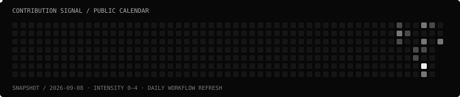

<div align="center">


<br>


<br>

<a href="https://github.com/leemaxyum?tab=repositories"></a>
<a href="https://github.com/leemaxyum"></a>

</div>

---

## ~/about

I learn by building: real-time multiplayer rooms, browser games, interfaces, and AI applications.

The loop is simple:

> **learn → build → test → break → understand → repeat**

I am early in the journey, so this profile is an honest build log—not a finished résumé.

---

## ~/now

```text
┌─ CURRENT SIGNAL ───────────────────────────────────────────────────────┐
│                                                                         │
│  BUILDING   Forest Quest · Fleavo / TPLAYTV                            │
│  LEARNING   JavaScript · TypeScript · C++ · game systems               │
│  PRACTICE   debugging · UI polish · state synchronization               │
│  NEXT       full-device playtests · stronger project documentation     │
│                                                                         │
└─────────────────────────────────────────────────────────────────────────┘
```

## ~/streak

<div align="center">


</div>

The card above reads from GitHub activity, so it updates without manually editing this README.

---

## ~/featured

### Fleavo / TPLAYTV — a shared screen, powered by phones

A TV-first real-time room platform: a host opens a room and phones join as players, controllers, and study participants.

**Focus:** room lifecycle · reconnection · state synchronization · multi-device UI  
**Stack:** Node.js · TypeScript · Socket.IO · Vite

[Repository →](https://github.com/leemaxyum/TPLAYTV)

---

### Forest Quest — action-platformer systems

A browser action-platformer with distinct stage archetypes, vertical routes, combat gates, diving enemies, upgrades, and boss-finishers.

**Focus:** movement feel · encounter design · game-state loops · effects  
**Stack:** JavaScript · Phaser 3 · HTML5 Canvas

[Repository →](https://github.com/leemaxyum/Forest-Quest)

---

### Phantom AI — AI application engineering

A chat application exploring streaming responses, conversation state, Markdown/code rendering, browser speech, and server-side API-key boundaries.

**Focus:** async UX · persistence · server boundaries · product polish  
**Stack:** React · TypeScript · Vite · Gemini · Netlify Functions

[Repository →](https://github.com/leemaxyum/phantom-ai)

---

## ~/toolbox

<div align="center">


</div>

Tools are listed here because I am actively learning or using them—not because I claim mastery of all of them.

---

## ~/contribution-map



[View full contribution activity →](https://github.com/leemaxyum)

---

## ~/build-log

```text
2026-08  TPLAYTV       real-time multiplayer foundation
2026-08  Phantom AI    AI application and server boundaries
2026-08  Forest Quest  action-platformer systems and encounter design
2026-09  Profile       a living public build log
```

<div align="center">

[GitHub](https://github.com/leemaxyum) · [Projects](https://github.com/leemaxyum?tab=repositories) · building in public

</div>
